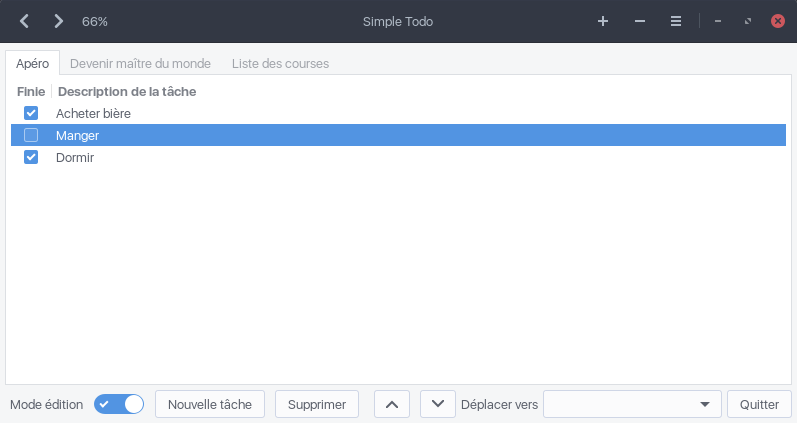

**SimpleTodo** is a small tabbed todo list manager, written in Python3 with a GTK3 interface.
It is now developed at [https://gitlab.volted.net/sogal/simpletodo](https://gitlab.volted.net/sogal/simpletodo).

